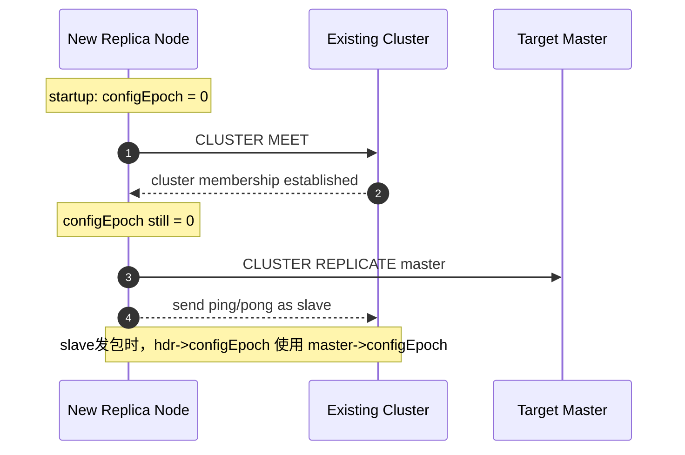
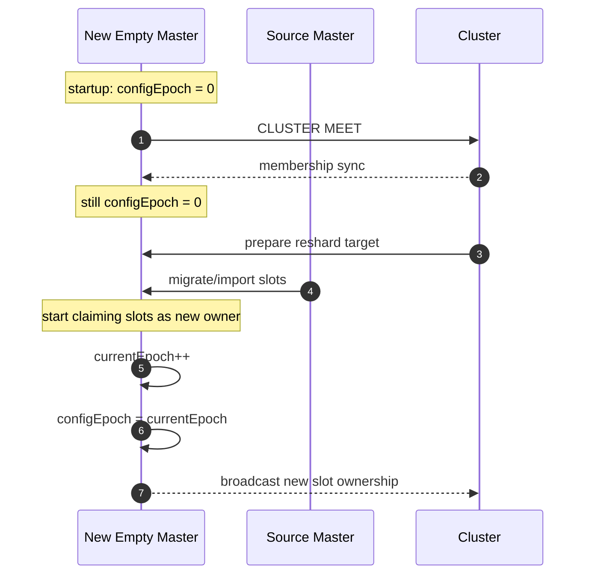
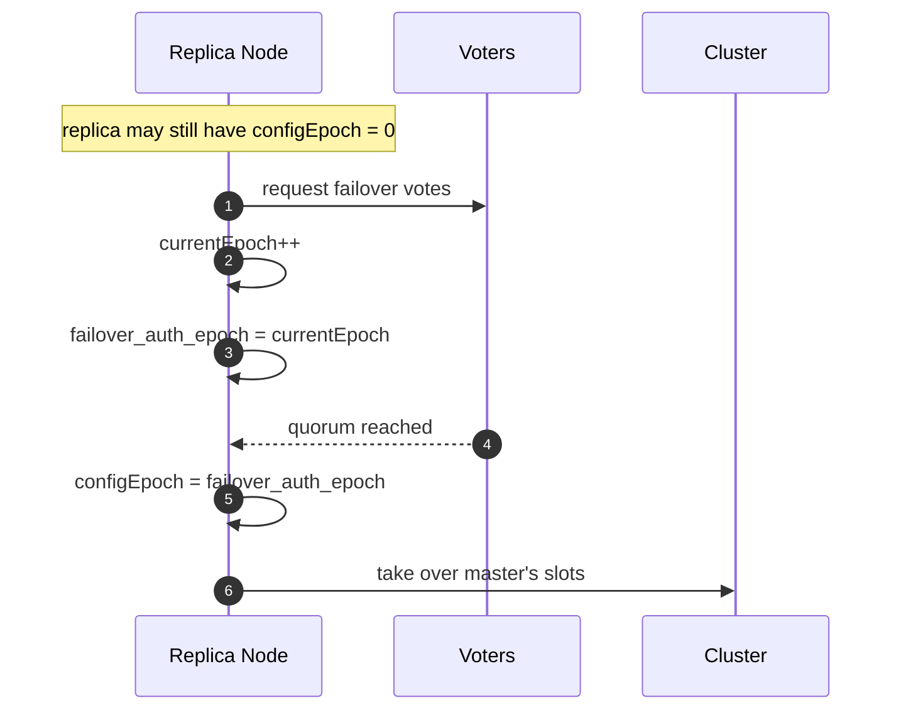

## Redis Cluster 中 `epoch` 的作用与变化

本文围绕两个问题展开：

- **`epoch` 在 Redis Cluster 中用来做什么**
- **`epoch` 在不同场景下是如何变化的**

文中主要讨论两个字段：

- **`currentEpoch`**：当前节点视角下已知的集群时代编号上界，更接近 cluster 级别的逻辑 term
- **`configEpoch`**：master 的 slot 配置版本号，用来表示“这份 slot ownership 配置有多新”

本文基于源码梳理，主要参考 [cluster.c](src/cluster.c) 和 [redis-cli.c](src/redis-cli.c)。

## 一、`epoch` 的作用

### 1. 作为配置传播时的版本背景

cluster bus 的 PING / PONG / MEET / UPDATE 等消息都会携带 epoch 信息。

这里的分工是：

- **`currentEpoch`**：表示“我目前知道集群至少演进到了哪个时代”
- **`configEpoch`**：表示“某个 master 当前广播的 slot 配置版本是多少”

因此节点在收到消息后，可以同时完成两件事：

- 用更大的 `currentEpoch` 推进自己对集群时代的认知
- 用更大的 `configEpoch` 更新自己对某个 master 配置版本的认知

从传播角度看，`epoch` 的核心作用就是：

- **给分布式配置附带可比较的版本号**
- **让不同节点在异步收包的前提下逐步收敛到一致视图**

### 2. 作为 slot ownership 的裁决依据

Redis Cluster 最关键的判断之一是：

- **当两个 master 对同一个 slot 给出不同归属声明时，应该相信谁**

这里真正起决定作用的是 **`configEpoch`**：

- 更大的 `configEpoch` 代表更新的 slot 配置版本
- 节点在看到更新版本后，会据此刷新本地的 slot owner 视图

所以 `configEpoch` 本质上就是：

- **slot ownership 的版本戳**
- **配置冲突时的优先级依据**

### 3. 作为 reshard / slot import 的切换版本

reshard 不只是迁移 key，更重要的是把 slot 的归属从旧 master 切换到新 master。

而这个切换要想在集群里稳定生效，就必须伴随一个新的配置版本。否则其他节点很难判断：

- 新 owner 的说法是不是比旧 owner 更新

因此在一个新 master 开始正式宣告自己拥有这些 slot 时，往往会先获得一个新的 `configEpoch`，再把新的 slot ownership 广播出去。

所以在 reshard / import 场景里，`epoch` 的作用是：

- **给新的 slot owner 一个更新的配置版本**
- **保证新配置能够覆盖旧配置**

### 4. 作为 failover 的选举轮次和晋升结果版本

在 failover 流程里，`currentEpoch` 和 `configEpoch` 分工很清晰：

- **`currentEpoch`**：
  - 表示本次 failover election 所在的轮次
  - replica 发起投票前会先进入新的 `currentEpoch`
  - 投票授权、去重和幂等控制都依赖这个轮次语义

- **`configEpoch`**：
  - replica 选举成功并晋升为 master 后
  - 会采用本次 failover 对应的 `failover_auth_epoch`
  - 用这个新版本去宣告自己接管了原 master 的 slot

所以从 failover 的角度看：

- **`currentEpoch` 负责组织一轮新的领导权竞争**
- **`configEpoch` 负责把竞争结果固化为新的 slot 配置版本**

### 5. 作为 `cluster create` 的初始化版本

在新建整个集群时，多个 fresh master 一开始都没有历史配置版本。为了避免一上来就出现配置语义不清或版本冲突，`redis-cli --cluster create` 会先给每个节点显式设置不同的 `configEpoch`，再让它们互相 `MEET`。

因此在 `cluster create` 场景里，`epoch` 的作用是：

- **给初始 master 预分配不同的配置版本号**
- **让集群从建立之初就具备明确的 slot 配置版本关系**

### 6. 作为 collision 修复的收敛手段

理论上，不同 master 不应该长期持有相同的有效 `configEpoch` 去发布配置；但在某些初始化或异常场景下，冲突仍可能出现。

这时 Redis Cluster 会进入 collision resolution：

- 发现两个 master 持有相同的 `configEpoch`
- 结合节点 ID 等规则决定哪一方重新 bump
- 让冲突中的一方获得更大的 `configEpoch`

所以在 collision 修复里，`epoch` 的作用是：

- **让配置冲突变成一个可自动收敛的问题**
- **通过重新分配更大的版本号恢复全局有序关系**

### 7. 一句话概括两者分工

如果只记一句话，可以记成：

- **`currentEpoch` 负责给 cluster 中的新一轮事件编号**
- **`configEpoch` 负责给 master 的 slot 配置版本编号**

前者更偏向：

- failover 选举轮次
- 集群逻辑时代推进
- 新一轮配置演进的编号

后者更偏向：

- slot owner 裁决
- 新配置覆盖旧配置
- master 对外发布的配置版本

## 二、`epoch` 的变化

### 1. fresh node 启动时

一个 fresh node 创建 `clusterNode` 时，`configEpoch` 默认初始化为 `0`。

这意味着：

- **节点刚启动时，并没有自己的有效 slot 配置版本**
- 后续是否会获得非 `0` 的 `configEpoch`，取决于它在 cluster 中扮演的角色

### 2. 通过 `CLUSTER MEET` 加入集群时

`CLUSTER MEET` / 握手过程只负责把节点加入集群视图，不负责给它分配新的 `configEpoch`。

因此一个新加入节点在这个时刻的典型状态是：

- **加入动作本身不会分配新的 `configEpoch`**
- **节点刚被 `MEET` 进 cluster 时，`configEpoch` 通常仍然是 `0`**

同时，其他节点在收包后做的事情也只是：

- 学习对方广播出来的 `currentEpoch`
- 学习对方广播出来的 `configEpoch`
- 用更大的值更新自己本地对对方的认知

也就是说：

- **集群里的其他节点不会替新节点现场生成 `configEpoch`**
- **join 负责建立成员关系，不负责分配配置版本**

### 3. 加入后作为 replica 时

如果新节点加入后被配置成 replica，那么它自己的 `configEpoch` 很可能长期仍然是 `0`。

原因是：

- replica 不负责对外声明 slot ownership
- cluster bus 发包时，如果自己是 slave，带出去的通常是 **master 的 `configEpoch`**

所以这个场景的典型变化路径是：

1. fresh node 启动，`configEpoch = 0`
2. `CLUSTER MEET` 加入集群
3. `CLUSTER REPLICATE <master>` 挂到某个 master 下
4. 之后发包时，对外传播的是主节点的 `configEpoch`

因此：

- **新加入 replica 自身长期保持 `0` 是正常现象**
- **它第一次拿到自己的非 `0` `configEpoch`，往往要等到未来被提升为 master**

### 4. 加入后作为空 master，并开始接收 slot 时

如果新节点加入后准备作为一个新的空 master 接收 slot，那么它在刚加入时通常也还是 `0`。

真正发生变化的时机是：

- 它开始以 master 身份对外宣告“这些 slot 现在属于我”

这时会进入类似 `clusterBumpConfigEpochWithoutConsensus()` 的逻辑：

- 先计算当前视角下已知的最大 epoch
- 如果自己是 `0`，或者自己不是当前最大
- 则执行：
  - `currentEpoch++`
  - `myself->configEpoch = currentEpoch`

所以这个场景的关键点是：

- **不是节点一加入就拿到“最大值 + 1”**
- **而是它开始承担 slot ownership 责任时，才会 bump 出新的 `configEpoch`**

### 5. replica 发生 failover，晋升为 master 时

这是 `configEpoch` 变化最清晰的一条路径。

典型流程如下：

1. replica 发起 failover election
2. 本地先推进到新的 `currentEpoch`
3. 同时记录 `failover_auth_epoch = currentEpoch`
4. 当达到 quorum、选举成功后
5. 如果自己的 `configEpoch` 小于 `failover_auth_epoch`
6. 则把：
   - `myself->configEpoch = failover_auth_epoch`

因此：

- **failover 成功后，新 master 的 `configEpoch` 通常等于该次选举的 epoch**
- **这也是很多 replica 第一次拿到非 `0` `configEpoch` 的时刻**

### 6. `cluster create` 新建集群时

`cluster create` 和普通的 `add-node` 不一样。

在这个场景里，`redis-cli` 会先对 fresh node 显式执行：

- `CLUSTER SET-CONFIG-EPOCH 1`
- `CLUSTER SET-CONFIG-EPOCH 2`
- `CLUSTER SET-CONFIG-EPOCH 3`
- ...

然后再让这些节点互相 `MEET`。

所以这里的变化顺序是：

- **先预设 `configEpoch`**
- **再建立节点之间的成员关系**

因此：

- **`cluster create` 里的 `configEpoch` 往往是 join 之前就写好的**
- **它和 add-node 到已有集群时的行为并不一样**

### 7. 出现 `configEpoch` collision 时

如果两个 master 使用了相同的 `configEpoch`，并同时对外发布配置，集群会进入 collision 处理。

简化理解为：

- 冲突双方比较节点 ID
- 其中一方执行新的 epoch bump
- 再把自己的 `configEpoch` 改成更大的值

所以这个场景里的变化方向是：

- **从“重复版本号”收敛到“重新拉开版本差”**
- **通过新的更大 `configEpoch` 恢复配置裁决的单调性**

### 8. 变化路径总结

如果只看最常见的几条路径，可以总结成：

- **只是 `MEET` 加入**：`configEpoch` 通常还是 `0`
- **加入后作为 replica**：自身通常仍是 `0`，对外传播主节点的 `configEpoch`
- **加入后作为空 master 接收 slot**：开始宣告 slot ownership 时 bump 出新的 `configEpoch`
- **replica failover 晋升为 master**：`configEpoch` 取该次 failover election 的 epoch
- **`cluster create`**：由工具先执行 `SET-CONFIG-EPOCH`，再执行 `MEET`
- **epoch collision**：通过冲突修复逻辑重新 bump 出更大的版本号

### 9. 时序图

### 9.1 新节点加入并作为 replica

### 9.2 新节点加入并作为空 master 接收 slot

### 9.3 replica failover 晋升为 master

### 10. 关键源码入口

如果后续需要继续深挖，可以重点看这些位置：

- [cluster.c](/Users/apsara/Develop/tencent_crs/redis5-src/src/cluster.c)
  - `createClusterNode()`
  - `clusterStartHandshake()`
  - cluster bus 发包逻辑中 `hdr->configEpoch` 的设置
  - `clusterBumpConfigEpochWithoutConsensus()`
  - `clusterHandleConfigEpochCollision()`
  - failover 成功后把 `myself->configEpoch` 设为 `failover_auth_epoch` 的逻辑
  - `CLUSTER SET-CONFIG-EPOCH` 命令处理逻辑

- [redis-cli.c](/Users/apsara/Develop/tencent_crs/redis5-src/src/redis-cli.c)
  - cluster create 时预设 `configEpoch` 的流程

### 11. 一页版结论

- **`currentEpoch`**：cluster 级的事件编号 / 逻辑时代上界
- **`configEpoch`**：master 级的 slot 配置版本号
- **`CLUSTER MEET`**：建立成员关系，不分配新的 `configEpoch`
- **新 replica**：自身可长期为 `0`，对外传播 master 的 `configEpoch`
- **新空 master 接收 slot**：开始宣告 slot ownership 时 bump 新版本
- **failover 晋升**：`configEpoch` 取 failover election 的 epoch
- **`cluster create`**：先 `SET-CONFIG-EPOCH`，再 `MEET`
- **collision 修复**：通过再次 bump 恢复版本有序性
